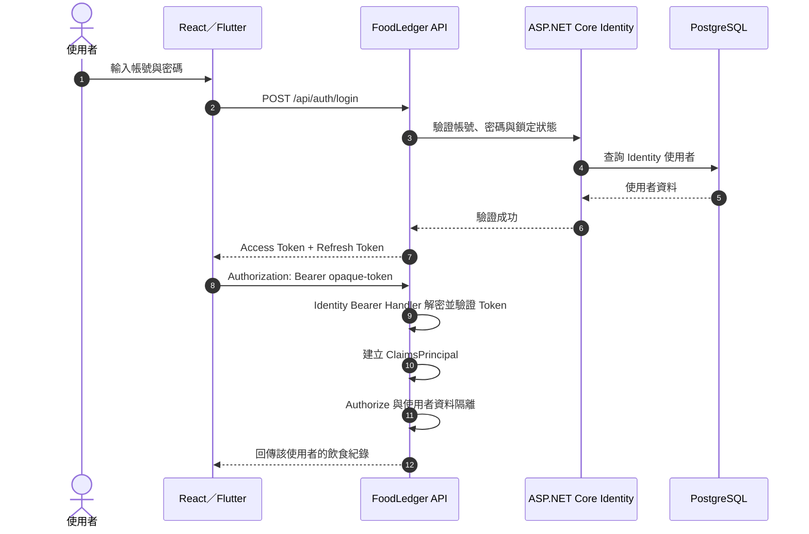
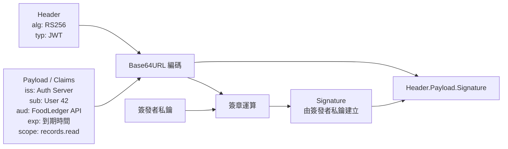
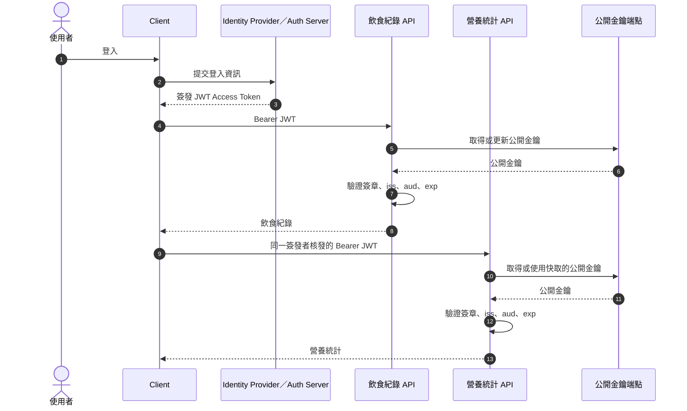

# Identity Bearer Token 與 JWT 驗證比較

## 1. 先釐清三個不同層級的概念

`Bearer`、`JWT` 與 `Cookie` 解決的是不同問題，彼此不是互斥選項。

| 名稱 | 解決的問題 | 說明 |
|---|---|---|
| Bearer | 憑證如何被使用 | 持有 Token 的呼叫端即可使用它；常見傳遞方式是 `Authorization: Bearer {token}`。 |
| JWT | Token 的資料格式 | 使用標準化 claims 表達身分，通常以簽章保護完整性。 |
| Cookie | 瀏覽器如何保存及傳送憑證 | 瀏覽器可自動保存 Cookie，後續 request 會依 Cookie 規則自動攜帶。 |

因此：

- JWT 可以作為 Bearer Token 使用。
- Bearer Token 不一定是 JWT，也可以是無法從外觀判讀內容的 opaque token。
- Cookie 裡可以保存登入票證或 Token，但 Cookie 本身不是 Token 格式。

> Bearer Token 的核心特性是「持有者可用」。Token 一旦外洩，取得者可能冒用，因此傳輸時必須使用 HTTPS，且不能寫入 log 或暴露給不必要的程式碼。

## 2. FoodLedger 目前使用什麼？

目前 `Program.cs` 使用：

```csharp
builder.Services.AddAuthentication(IdentityConstants.BearerScheme)
    .AddBearerToken(IdentityConstants.BearerScheme);
```

這是 ASP.NET Core Identity 提供的 Bearer Token：

- 使用 `Authorization: Bearer {token}` 傳遞。
- Token 是 ASP.NET Core Identity 專用的 opaque token，不是 JWT。
- Access token 與 refresh token 的保護和解析由 ASP.NET Core 處理。
- 呼叫端不應自行解析 Token，也不應依賴其內部結構。
- 適合簡單 API、行動 App，或不能使用 Cookie 的 client。

Microsoft 官方文件也明確說明，Identity API 產生的是 ASP.NET Core Identity 專用 Token，而不是標準 JWT；對瀏覽器型應用程式，官方優先建議使用 Cookie，避免憑證暴露給 JavaScript。

## 3. Identity Bearer Token 的驗證流程



驗證重點：

1. Token 是否能由 ASP.NET Core 的保護機制成功解析。
2. Token 是否已過期。
3. Token 內的驗證票證是否有效。
4. 驗證成功後，建立 `ClaimsPrincipal` 供 `[Authorize]` 與 Service 使用。

## 4. JWT Bearer Token 的結構

常見的簽章 JWT（JWS Compact Serialization）由三段組成：

```text
base64url(header).base64url(payload).base64url(signature)
```

概念圖：



JWT Payload 常見 claims：

| Claim | 意義 |
|---|---|
| `iss` | Token 簽發者 |
| `sub` | Token 所代表的主體，例如使用者 ID |
| `aud` | Token 預定提供給哪一個 API |
| `exp` | 到期時間 |
| `nbf` | 在此時間之前不可使用 |
| `iat` | Token 簽發時間 |
| `jti` | Token 唯一識別碼 |
| `scope`／`roles` | 允許的操作範圍或角色 |

> 一般簽章 JWT 的 Payload 是編碼，不是加密。取得 Token 的人通常可以讀取 Claims，因此不能放入密碼、連線字串或其他敏感資訊。

## 5. JWT 在多個獨立 API 的驗證流程



非對稱簽章情境下：

- Auth Server 保存私鑰並負責簽發 Token。
- 各 API 只需要公開金鑰即可驗證簽章。
- API 不需要共用使用者密碼或 Identity 資料庫。
- 各 API 仍必須驗證 `issuer`、`audience`、簽章及有效期限，不能只把 JWT 解碼後就信任內容。

## 6. 驗證方式的主要差異

| 比較項目 | ASP.NET Core Identity Bearer Token | JWT Bearer Token |
|---|---|---|
| Token 格式 | Identity 專用 opaque token | 標準 JWT |
| Client 能否解析內容 | 不應解析 | 可以讀取未加密 Payload |
| API 驗證依據 | ASP.NET Core Identity／Data Protection 設定 | 簽發者公開金鑰或共享密鑰 |
| 跨語言支援 | 較差 | 良好 |
| 多個獨立 API 驗證 | 需要共享相容設定與金鑰，耦合較高 | 各 API 可使用公開金鑰獨立驗證 |
| 需要集中式 Token Server | 簡單情境可不需要 | 正式多服務環境通常需要 |
| Claims 標準化與交換 | 不適合作為公開契約 | 適合跨服務傳遞標準 claims |
| Token 即時撤銷 | 需要額外設計 | 同樣需要額外設計 |
| 金鑰管理 | 依賴 Data Protection 金鑰管理 | 需要簽章金鑰保護、發布與輪替 |
| 適合 FoodLedger 現況 | 適合 | 可以使用，但目前收益有限 |

## 7. Identity Bearer Token 的優缺點

### 優點

- 與 ASP.NET Core Identity 整合直接。
- 不需要自行設計 JWT claims 與簽章流程。
- Token 內容不會直接暴露給 client。
- 已提供 access token 與 refresh token 的基礎能力。
- 適合目前單體 FoodLedger API 與未來 Flutter client。
- 可以搭配既有的 `[Authorize]`、roles 與 policies。

### 缺點

- Token 是 ASP.NET Core Identity 專用格式。
- 非 .NET 服務不容易自行驗證。
- 多個獨立服務若要共同驗證，通常必須共享 Data Protection 金鑰和相容設定。
- 共享金鑰與框架設定會增加服務間耦合。
- 不適合當成完整 OAuth 2.0／OpenID Connect Identity Provider。

## 8. JWT 的優缺點

### 優點

- 格式標準化，跨語言、跨框架支援良好。
- 各 API 可以使用公開金鑰獨立驗證，不必共用 Identity 資料庫。
- 適合多個獨立部署 API 共用同一個身分來源。
- `issuer`、`audience`、`scope` 等 claims 可明確描述信任邊界。
- 適合與 OAuth 2.0／OpenID Connect Identity Provider 整合。

### 缺點

- JWT Payload 通常可被讀取，不能把它當成加密資料。
- 已簽發的 JWT 通常會持續有效到過期，立即撤銷比較困難。
- 需要正確管理私鑰、公開金鑰發布與金鑰輪替。
- 需要設計 access token 有效期限、refresh token rotation、撤銷與重放防護。
- Claims 若放入容易變動的資料，可能在 Token 到期前與資料庫狀態不一致。
- 錯誤驗證 `issuer`、`audience`、演算法或簽章，可能造成嚴重安全問題。
- 對只有單一 API 的系統，增加的複雜度可能大於收益。

## 9. Cookie 與重新整理後維持登入

是否能在重新整理後維持登入，主要取決於 client 如何保存及傳送憑證，不取決於 Token 是否為 JWT。

Web 前端建議流程：

```mermaid
sequenceDiagram
    autonumber
    participant Browser as React Browser
    participant Api as FoodLedger API

    Browser->>Api: POST /api/auth/login
    Api-->>Browser: Set-Cookie: auth=...; HttpOnly; Secure
    Note over Browser: 瀏覽器保存 Cookie<br/>JavaScript 無法讀取 HttpOnly Cookie

    Browser->>Browser: 使用者重新整理頁面
    Browser->>Api: GET /api/users/me + Cookie
    Api->>Api: 驗證 Cookie 並建立 ClaimsPrincipal
    Api-->>Browser: 回傳 CurrentUserResponse
    Note over Browser: React 使用回應重建登入狀態
```

安全原則：

- Cookie 只保存驗證憑證，不保存 Email、DisplayName 或完整使用者資料。
- 使用 `HttpOnly` 降低 Token 被 JavaScript 讀取的風險。
- 正式環境使用 `Secure`，只允許 HTTPS 傳送。
- 根據前後端部署方式設定適當的 `SameSite`。
- 跨來源請求需要限制明確的 CORS origins，並啟用 credentials。
- 使用 Cookie 驗證時需要評估 CSRF 防護。
- 頁面初始化時透過 `/api/users/me` 取得最新使用者資料。

## 10. FoodLedger 的建議演進

### 現階段：單一 API

```text
React Web ────── Cookie ──────> FoodLedger API
Flutter App ─ Identity Bearer ─> FoodLedger API
```

建議：

- React Web 使用 ASP.NET Core Identity Cookie Authentication。
- Flutter 使用目前的 Identity Bearer Token。
- 登入後的使用者資料由 `/api/users/me` 取得。
- 飲食紀錄 API 必須從已驗證身分取得 `UserId`，不能信任前端傳入的 `UserId`。
- 暫時不為了「保持登入」而導入 JWT。

### 未來：增加獨立部署且共享使用者身分的 API

```text
                    ┌─> 飲食紀錄 API
Client -> Auth/OIDC ┼─> 營養統計 API
                    └─> 其他獨立 API
```

出現以下情況時，再評估 OAuth 2.0／OpenID Connect 與 JWT access token：

- 多個獨立部署 API 都需要驗證同一位使用者。
- API 使用不同程式語言或不同框架。
- 第三方 client 需要存取 FoodLedger API。
- 需要清楚劃分不同 API 的 audience 與 scopes。
- 需要與 Keycloak、Microsoft Entra ID、Auth0 等 Identity Provider 整合。

不是只要多一個後端專案就必須使用 JWT。如果新增的專案：

- 仍由同一個 ASP.NET Core Host 執行，通常不需要 JWT。
- 是不接受使用者 request 的背景工作程式，可能更適合 service-to-service credentials。
- 使用完全不同的帳號體系，不應直接共用 FoodLedger 使用者 Token。

判斷重點是：

> 是否有多個獨立部署、具有不同信任邊界的服務，需要共同驗證同一個使用者身分？

只有答案是「是」時，標準 JWT access token 的跨服務優勢才會明顯。

## 11. 參考資料

- [RFC 6750：OAuth 2.0 Bearer Token Usage](https://www.rfc-editor.org/rfc/rfc6750.html)
- [RFC 7519：JSON Web Token](https://www.rfc-editor.org/rfc/rfc7519.html)
- [Microsoft Learn：Use Identity to secure a Web API backend for SPAs](https://learn.microsoft.com/en-us/aspnet/core/security/authentication/identity-api-authorization?view=aspnetcore-10.0)
- [Microsoft Learn：Configure JWT bearer authentication in ASP.NET Core](https://learn.microsoft.com/en-us/aspnet/core/security/authentication/configure-jwt-bearer-authentication?view=aspnetcore-10.0)
