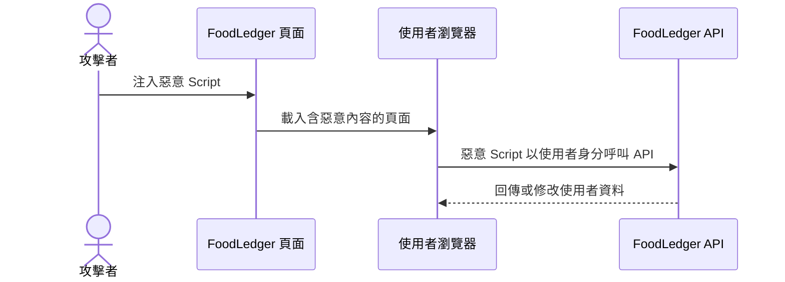
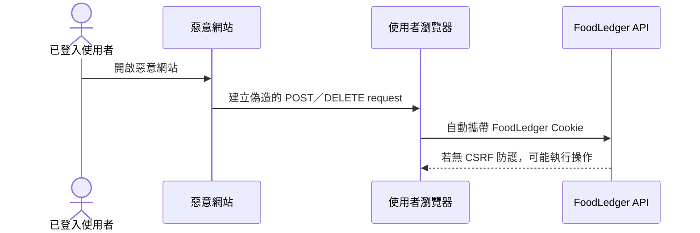

# Web Cookie Authentication 安全風險與防護

## 1. 適用範圍

本筆記說明 FoodLedger Web 使用 ASP.NET Core Identity Cookie Authentication 時，常見的攻擊方式、可能影響與預防措施。

Cookie Authentication 並非天然安全或不安全。安全性取決於：

- Cookie 屬性是否正確。
- 全站是否使用 HTTPS。
- 是否有 CSRF 與 XSS 防護。
- CORS 是否只允許可信任來源。
- 登入、登出與 Session 是否正確管理。
- 後端是否持續執行授權與使用者資料隔離。

FoodLedger 的認證 Cookie 只保存由 ASP.NET Core Identity 保護的 Authentication Ticket。Email、DisplayName、深色模式等應用程式資料不放入認證 Cookie。

## 2. 威脅與防護總覽

| 威脅 | 攻擊方式 | 可能影響 | 主要防護 |
|---|---|---|---|
| XSS | 注入惡意 JavaScript | 以使用者身分呼叫 API、竄改畫面 | `HttpOnly`、輸出編碼、CSP、避免不可信 HTML |
| CSRF | 惡意網站誘導瀏覽器自動帶 Cookie 發送 request | 新增、修改或刪除使用者資料 | Antiforgery Token、`SameSite`、驗證 Origin |
| Cookie 竊取 | 未加密網路、惡意程式或錯誤 log 取得 Cookie | Session 被冒用 | HTTPS、`Secure`、`HttpOnly`、不記錄 Cookie |
| Session Fixation | 攻擊者讓受害者沿用已知 Session | 登入後 Session 被接管 | 登入時重新簽發 Cookie、使用 Identity SignIn |
| CORS 誤設 | 任意 Origin 可帶 credentials 呼叫 API | 不可信網站讀取敏感 API 回應 | 明確 Origin allowlist、禁止 `AllowAnyOrigin` |
| Cookie 範圍過大 | Domain 或 Path 設得太廣 | 其他子網域或路徑收到憑證 | Host-only Cookie、最小化 `Path`／`Domain` |
| Session 過久 | 長效 Cookie 長時間有效 | 遺失裝置或舊 Cookie 持續可用 | 合理期限、Security Stamp、登出與撤銷 |
| Clickjacking | 惡意網站以 iframe 包住 FoodLedger | 誘導點擊敏感操作 | CSP `frame-ancestors` 或 `X-Frame-Options` |

## 3. XSS：跨網站指令碼攻擊

### 攻擊方式

攻擊者設法讓 FoodLedger 頁面執行惡意 JavaScript，例如：

- 將未編碼的使用者輸入直接插入 HTML。
- 使用不安全的 HTML render API。
- 載入遭入侵的第三方 Script。
- 前端套件存在可利用的 XSS 漏洞。



`HttpOnly` 能阻止 JavaScript 直接讀取 Cookie，但不能阻止惡意 Script 在受害者瀏覽器內發送同源 request。因此 `HttpOnly` 是重要防線，但不能取代 XSS 防護。

### 預防方式

- 認證 Cookie 設定 `HttpOnly`。
- 不使用不可信輸入產生原始 HTML。
- 依 Flutter Web／瀏覽器框架的安全輸出機制顯示文字。
- 設定 Content Security Policy，限制 Script 來源。
- 定期更新前端套件並處理安全公告。
- 不把 Access Token、Refresh Token 或 Cookie 寫入 log。
- 對使用者輸入進行後端驗證；前端驗證不能作為安全邊界。

## 4. CSRF：跨網站請求偽造

### 攻擊方式

瀏覽器會依 Cookie 規則自動攜帶 Cookie。使用者登入 FoodLedger 後，如果造訪惡意網站，該網站可能誘導瀏覽器向 FoodLedger 發送修改資料的 request。



### 預防方式

- 狀態變更 request 驗證 ASP.NET Core Antiforgery Token。
- 使用 `SameSite=Lax`；部署條件允許時可評估 `Strict`。
- `SameSite=None` 必須搭配 `Secure`，並強制使用 Antiforgery 防護。
- CORS 只允許設定中的 FoodLedger 前端 Origin。
- 不使用 `AllowAnyOrigin()` 搭配 credentials。
- `GET`、`HEAD`、`OPTIONS` 只能執行唯讀操作。
- 可額外驗證 `Origin`／`Referer`，但不應單獨取代 Antiforgery Token。
- Bearer Token client 不依賴瀏覽器自動附加憑證，通常不使用 Cookie Antiforgery 流程。

## 5. Cookie 竊取與傳輸攔截

### 攻擊方式

- 使用 HTTP 傳輸時遭中間人攔截。
- Cookie 被寫入 application log、proxy log 或錯誤追蹤平台。
- 瀏覽器擴充套件、惡意程式或共用裝置取得瀏覽器資料。
- XSS 讀取未設定 `HttpOnly` 的 Cookie。

### 預防方式

- 正式環境全面使用 HTTPS。
- Cookie 設定 `Secure`，禁止透過 HTTP 傳送。
- Cookie 設定 `HttpOnly`。
- 不記錄 `Cookie`、`Set-Cookie`、Access Token 或 Refresh Token。
- 使用 HSTS 降低 HTTPS downgrade 風險。
- Cookie 名稱使用 `__Host-` 前綴時，必須搭配 `Secure`、`Path=/` 且不能設定 `Domain`。

## 6. Session Fixation

### 攻擊方式

攻擊者預先取得或指定一組 Session，誘導使用者使用該 Session 登入。如果登入後仍沿用攻擊者已知的 Session，攻擊者可能接管登入狀態。

### 預防方式

- 登入成功後重新簽發 Authentication Cookie。
- 使用 ASP.NET Core Identity 的 SignIn 流程，不自行建立可預測 Session ID。
- 登出時呼叫 Identity SignOut 並讓 Cookie 失效。
- 權限提升或敏感帳號變更後重新驗證 Session。

## 7. CORS 與 credentials 誤設

### 危險設定

```csharp
policy
    .AllowAnyOrigin()
    .AllowCredentials();
```

瀏覽器規格不允許 wildcard origin 搭配 credentials；即使透過反射 Origin 等方式繞過限制，也會讓不可信網站取得跨來源讀取能力。

### 預防方式

- 使用設定檔提供明確 Origin allowlist。
- 比對完整 Origin，包含 scheme、host 與 port。
- 只對需要的前端開啟 `.AllowCredentials()`。
- Development 的 localhost 放行規則不可自動套用到 Production。
- 不把 CORS 當成授權機制；API 仍須使用 `[Authorize]` 和資料隔離。

## 8. 建議 Cookie 屬性

同 site 的 Web 前端與 API 可優先使用：

```csharp
options.Cookie.HttpOnly = true;
options.Cookie.SecurePolicy = CookieSecurePolicy.Always;
options.Cookie.SameSite = SameSiteMode.Lax;
options.Cookie.Path = "/";
```

部署注意事項：

- `app.example.com` 與 `api.example.com` 是不同 origin，但通常屬於同一個 site。
- 若前後端位於完全不同 site，可能需要 `SameSite=None; Secure`。
- `SameSite=None` 會增加跨站自動帶 Cookie 的機會，必須搭配 Antiforgery Token。
- 開發環境若使用純 HTTP，需要明確的開發策略；正式環境不可因此降低 `Secure` 要求。

## 9. FoodLedger 建議流程

```mermaid
sequenceDiagram
    participant Web as Flutter Web
    participant Api as FoodLedger API
    participant Identity as ASP.NET Core Identity

    Web->>Api: GET /api/auth/antiforgery
    Api-->>Web: Antiforgery request token + Cookie
    Web->>Api: POST /api/auth/login + Antiforgery Header
    Api->>Identity: 驗證帳號密碼
    Identity-->>Api: 驗證成功並重新簽發 Session
    Api-->>Web: Set-Cookie: HttpOnly; Secure; SameSite

    Web->>Api: GET /api/users/me + Cookie
    Api-->>Web: 最新使用者資料

    Web->>Api: POST /api/daily-records + Cookie + Antiforgery Header
    Api->>Api: 驗證 Cookie、Antiforgery 與 UserId
    Api-->>Web: 204 No Content
```

## 10. 實作檢查清單

- [ ] Cookie 使用 `HttpOnly`。
- [ ] 正式環境 Cookie 使用 `Secure`。
- [ ] Cookie 設定適當的 `SameSite`。
- [ ] CORS 使用明確 Origin allowlist 並允許 credentials。
- [ ] Cookie 模式的狀態變更 request 驗證 Antiforgery Token。
- [ ] 登入成功重新簽發 Cookie。
- [ ] 登出清除 Cookie。
- [ ] 未登入或 Cookie 失效時回傳 `401`。
- [ ] API 不信任前端傳入的 `UserId`。
- [ ] Cookie、Token、密碼與個資不寫入 log。
- [ ] 深色模式使用獨立的本機偏好儲存，不混入認證 Cookie。
- [ ] Flutter Android／iOS 的 Bearer Token 使用平台安全儲存。

## 11. 參考資料

- [OWASP Cross Site Request Forgery Prevention Cheat Sheet](https://cheatsheetseries.owasp.org/cheatsheets/Cross-Site_Request_Forgery_Prevention_Cheat_Sheet.html)
- [OWASP Cross Site Scripting Prevention Cheat Sheet](https://cheatsheetseries.owasp.org/cheatsheets/Cross_Site_Scripting_Prevention_Cheat_Sheet.html)
- [Microsoft Learn：Prevent Cross-Site Request Forgery attacks in ASP.NET Core](https://learn.microsoft.com/en-us/aspnet/core/security/anti-request-forgery)
- [Microsoft Learn：Configure ASP.NET Core Identity](https://learn.microsoft.com/en-us/aspnet/core/security/authentication/identity-configuration)
